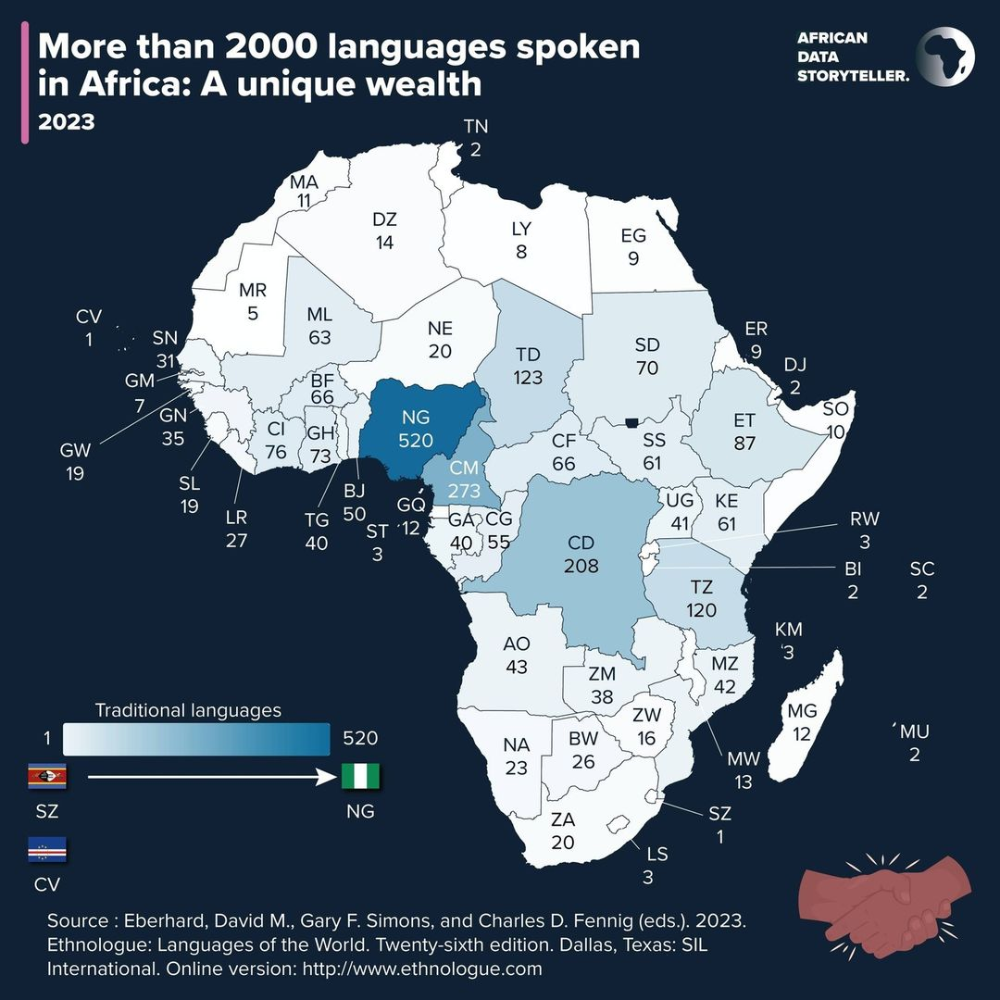
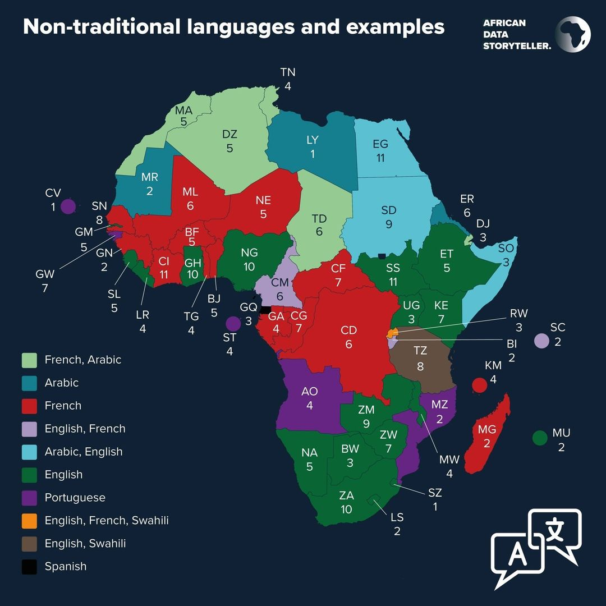
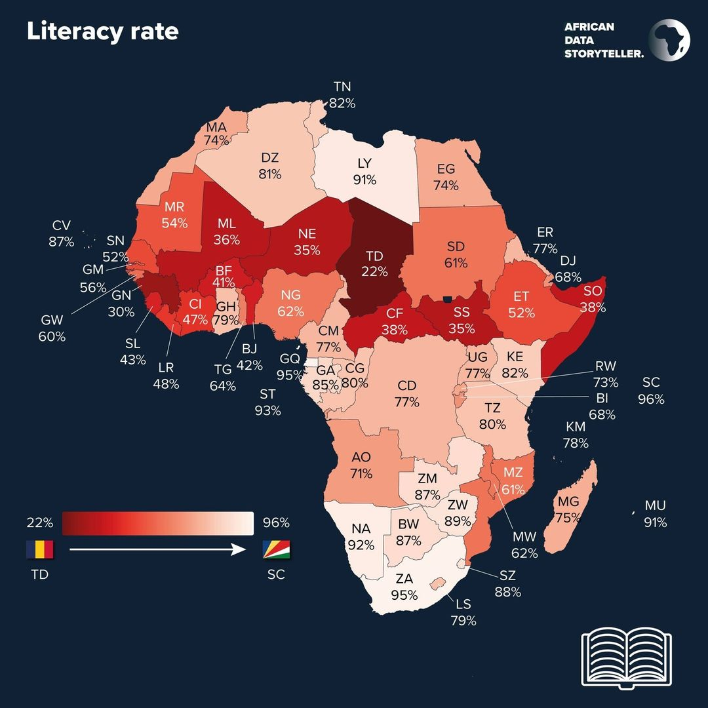

# Griot AI

## Introduction

Griot AI is a student project aimed at developing a translator specifically tailored for Western African languages. The project initially focuses on supporting languages from the Bamana family, leveraging techniques and resources from [Kasa](https://github.com/GhanaNLP/kasa), a platform for African language processing.

 

## Table of Contents

- [Griot AI](#griot-ai)
  - [Introduction](#introduction)
  - [Table of Contents](#table-of-contents)
  - [Authors](#authors)
  - [Context](#context)
  - [The objective of this project](#the-objective-of-this-project)
  - [Features](#features)
  - [Benefits](#benefits)
  - [Getting Started](#getting-started)
  - [Usage](#usage)
  - [Databases](#databases)
  - [**Acknowledgments**](#acknowledgments)

## Authors

- [Elijah Ki-Zerbo](https://github.com/Waranika)
- [Theotime Perrichet](https://github.com/TheoTime01)
- [Chan-Yeong Hwang]()

## Context

Africa's linguistic landscape testifies to the richness of its cultural heritage, with over 2000 traditional languages that are the guardians of collective memory. These languages encapsulate the complex history of civilizations, dynasties and empires, offering a window on the continent's diverse past. Each language, with its unique proverbs, songs and riddles, contributes to a better understanding of African identity.

However, most of these languages are still spoken, which is why an *AI translation model* could be a **social and economic opportunity** to offer tools to people with little or no command of European languages such as **English**, **French** or **Portuguese**

<div style="display: flex; justify-content: space-between;">
    
    
    
</div>

**source** : *https://www.datastoryteller.africa/postsen*

## The objective of this project

The objectives of this project are:

- [ ] develop a model for translating between several African languages and European languages
- [ ] to be able to make text-to-speech and speech-to-text in these languages

## Features

The Griot AI project includes the following features:

- Translation capabilities between English and languages from the Bamana family.
- Implementation of transformer-based models for translation tasks.
- Modular design facilitating the easy addition of support for additional languages.

## Benefits

The development and deployment of a translator for Western African languages offer several advantages:

- **Improved Communication:** The translator enhances communication and understanding between speakers of English and Western African languages, fostering collaboration, knowledge exchange, and cultural appreciation.
- **Access to Information:** It enables speakers of Western African languages to access information and resources available in English, breaking down language barriers and promoting inclusivity.
- **Empowerment of Communities:** By offering translation tools tailored to their linguistic needs, the project empowers communities to engage more effectively in various domains, including education, healthcare, and governance.
- **Technological Advancement:** The development of such a translator showcases advancements in natural language processing (NLP) technology and demonstrates its applicability to underrepresented languages and regions.

## Getting Started

To begin using the translator, follow these steps:

1. **Clone the Repository:**

   ```bash
   git clone https://github.com/your-username/west-african-translator.git
   cd west-african-translator
   ```

2. **Install Dependencies:**  
   Ensure all necessary dependencies are installed. Detailed instructions can be found in the project's documentation.

3. **Run the Flask Application:**

   ```bash
   python app.py
   ```

4. **Access the Translator Interface:**  
   Open a web browser and navigate to **http://localhost:5000** to access the translator interface.

## Usage

Most African languages have their own alphabets in Latin based on the phonetic alphabet, for example the Bambara alphabet is :


## Databases

Store in the folder *Web\Data*


## **Acknowledgments**

The project is heavily based on Kasa.
Special thanks to the GhanaNLP team for their contributions to the field of African language processing.
